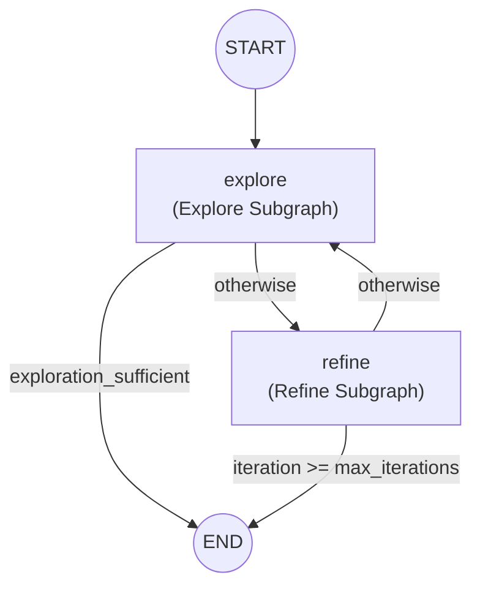
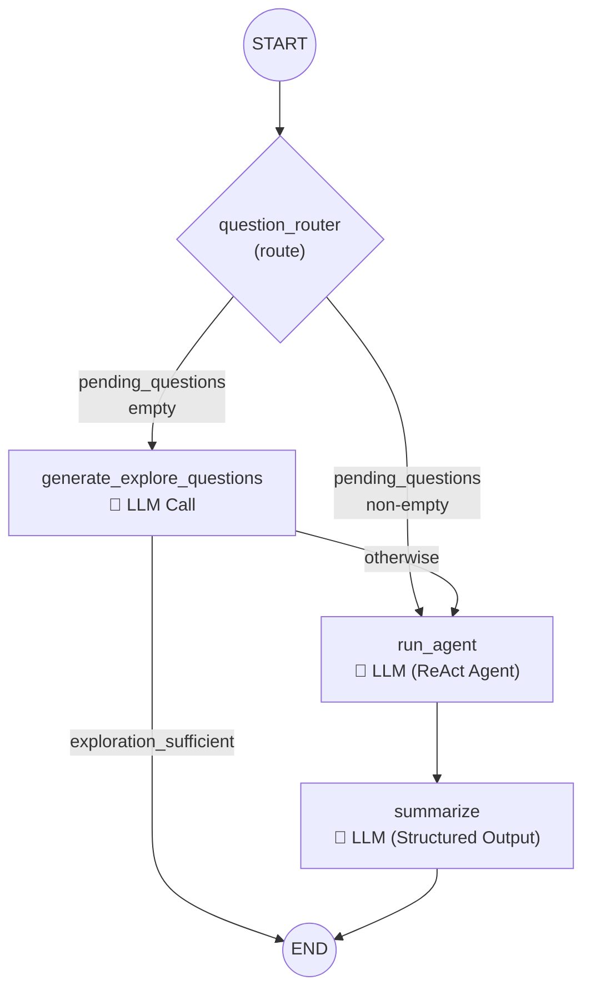
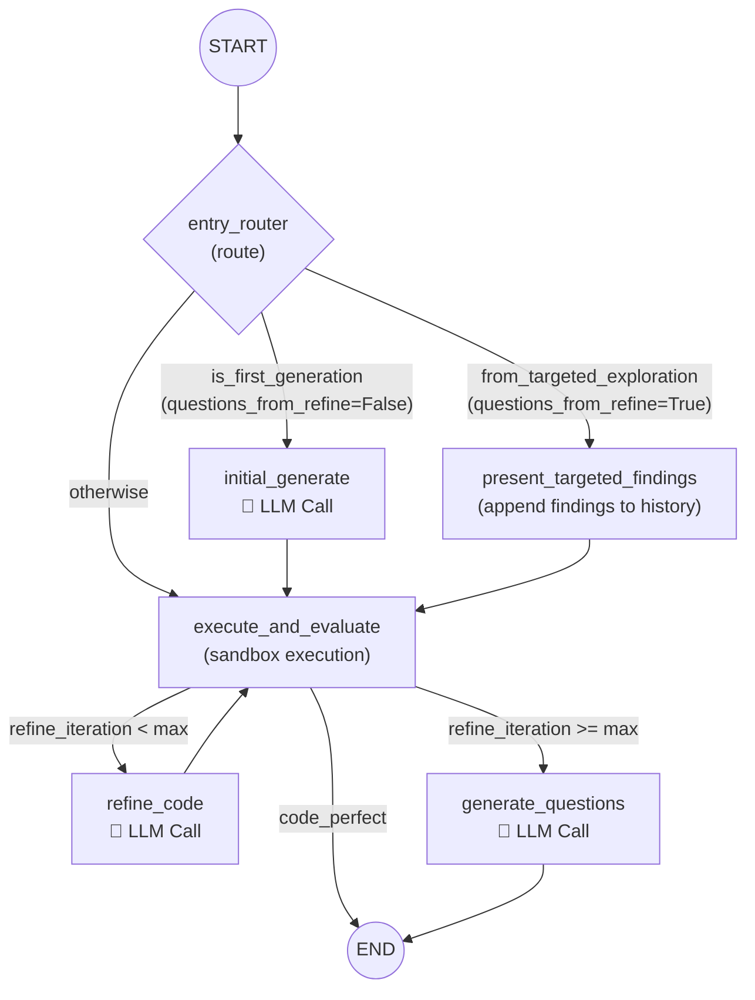

# Baseline Explorer Agent for AutumnBench

An iterative **explore-then-refine** agent built with [LangGraph](https://github.com/langchain-ai/langgraph). The agent discovers the transition dynamics of an interactive grid environment by alternating between two phases:

1. **Exploration** — the explore subgraph first ensures investigation questions exist (generating them if needed), then a ReAct agent interacts with the environment to collect trajectories, and finally a summarise node answers those questions as structured Q&A.
2. **Code Refinement** — an LLM generates or iteratively improves a `predict_dynamics` function until it matches all collected trajectories.

Across iterations the agent accumulates a trajectory library, Q&A knowledge, and the current source code. When refinement cannot reach 100 % accuracy, it generates an investigation question that is passed to the next exploration round as a targeted question.

---

## Overall Architecture (Main Graph)



### Routing Logic

**`route_after_explore` (after explore):**

| Condition | Next Node |
|---|---|
| `exploration_sufficient` is True | **END** — the explore LLM decided no further exploration is valuable |
| Otherwise | `refine` |

**`decide_next` (after refine):**

| Condition | Next Node |
|---|---|
| `iteration >= max_iterations` | **END** |
| Otherwise | `explore` |

After refinement, `pending_questions` may or may not be populated. The explore subgraph handles both cases internally: if questions exist (from refine), it uses them directly (targeted); if not, it generates its own (free).

### Free vs. Targeted Exploration

The explore subgraph determines the mode automatically via an internal `question_router`:

| Aspect | Free (self-generated questions) | Targeted (questions from refine) |
|---|---|---|
| Trigger | `pending_questions` is empty when explore starts | `pending_questions` is non-empty (from refine's `generate_questions`) |
| Question source | `generate_explore_questions` node (LLM call) | Passed in from refine subgraph |
| `questions_from_refine` flag | `False` | `True` |
| Refine entry | `initial_generate` (code from scratch) | `present_targeted_findings` (existing code + findings) |

---

## Explore Subgraph



### Nodes

| Node | Type | Description |
|---|---|---|
| `question_router` | Passthrough | Sets `questions_from_refine` flag; routes to `generate_explore_questions` or `run_agent` |
| `generate_explore_questions` | LLM call | Generates 2-3 investigation questions for free exploration (only reached when no questions are pre-populated). May also signal `exploration_sufficient=True` to exit early. |
| `run_agent` | LLM (ReAct agent) | Interacts with the environment via tools (`env_step`, `env_reset`, `stop_exploration`) to collect trajectories |
| `summarize` | LLM (structured output) | Answers the investigation questions as structured Q&A pairs based on the exploration conversation |

### State (`ExploreState`)

| Field | Type | Direction | Description |
|---|---|---|---|
| `current_code` | `Optional[str]` | Input | Current `predict_dynamics` source (shown to agent for context) |
| `explored_qa` | `list[dict]` | Input | Historical Q&A pairs from prior explorations |
| `pending_questions` | `list[str]` | Input/Internal | Investigation questions — from refine or self-generated by `generate_explore_questions` |
| `error_frames` | `list[dict]` | Input | Mispredicted frames from code evaluation |
| `max_explore_steps` | `int` | Input | Maximum actions per exploration |
| `env_name` | `str` | Input | Environment name (`.sexp` file stem) |
| `data_dir` | `str` | Input | Directory containing environment files |
| `use_obfuscation` | `bool` | Input | Whether to obfuscate object-type names |
| `agent_messages` | `list` | Internal | Full ReAct agent conversation history |
| `new_trajectories` | `list[dict]` | Output | Trajectories collected this round |
| `new_qa` | `list[dict]` | Output | Q&A pairs produced this round |
| `questions_from_refine` | `bool` | Output | `True` if questions came from refine, `False` if self-generated |
| `exploration_sufficient` | `bool` | Output | `True` if the LLM decides no further exploration is needed; causes both explore and main graph to exit early |

---

## Refine Subgraph



### Routing Logic

**`route_entry` (after `entry_router`):**

| Condition | Next Node | When |
|---|---|---|
| `is_first_generation` is True | `initial_generate` | After free exploration (`questions_from_refine=False`) or first iteration |
| `from_targeted_exploration` is True | `present_targeted_findings` | After targeted exploration (`questions_from_refine=True`) |
| Otherwise | `execute_and_evaluate` | Fallback (should not occur in normal flow) |

**`route_after_evaluate` (after `execute_and_evaluate`):**

| Condition | Next Node |
|---|---|
| `code_perfect` is True (accuracy == 100 %) | **END** |
| `refine_iteration < max_refine_iterations` | `refine_code` |
| Otherwise (max iterations reached) | `generate_questions` |

### State (`RefineState`)

| Field | Type | Description |
|---|---|---|
| `code` | `str` | Current `predict_dynamics` source code |
| `all_trajectories` | `list` | All trajectories to evaluate against |
| `targeted_trajectories` | `list` | Trajectories from targeted exploration |
| `from_targeted_exploration` | `bool` | Whether to present targeted-exploration findings first |
| `conversation_history` | `list[BaseMessage]` | Multi-turn chat history (persisted across refine iterations within one cycle) |
| `refine_iteration` | `int` | Number of refine LLM calls so far |
| `max_refine_iterations` | `int` | Limit on refine iterations per cycle |
| `accuracy` | `float` | Latest overall accuracy |
| `total_correct` | `int` | Number of correctly predicted frames |
| `total_frames` | `int` | Total number of evaluated frames |
| `execution_error` | `Optional[str]` | Error message if code crashed |
| `per_trajectory_results` | `list` | Raw per-trajectory execution results |
| `first_error_frames` | `list` | First error frame per trajectory |
| `questions` | `list[str]` | Diagnostic questions for the explorer |
| `code_perfect` | `bool` | True if accuracy == 1.0 |
| `is_first_generation` | `bool` | True when no code exists yet |
| `new_qa` | `list[dict]` | New Q&A pairs from latest exploration |
| `all_qa` | `list[dict]` | All historical Q&A pairs |

**Note:** `conversation_history` is only persisted within the refine subgraph's internal loop (across `refine_code` ↔ `execute_and_evaluate` iterations). It is **not** carried across main-graph loops — each main-loop cycle starts refinement with a fresh conversation.

---

## LLM-Calling Nodes — Detailed Input / Output Specification

### 1. `run_agent` (Explore Subgraph)

**LLM usage:** ReAct agent loop (`langchain.agents.create_agent`) — the LLM is called repeatedly as it decides which tool to invoke.

#### Inputs

| Input | Source Variable(s) | Description |
|---|---|---|
| System prompt | Built dynamically from multiple state fields (see below) | Instructions, context, and investigation questions |
| Initial user message | `env.get_observation()` | JSON representation of the initial grid state |

**System prompt composition** (conditional sections appended based on state):

| Section | Condition | State Variables Used |
|---|---|---|
| Base exploration instructions | Always included | — |
| Current code section | `current_code is not None` | `current_code` |
| Q&A knowledge section | `explored_qa` is non-empty | `explored_qa` |
| Investigation questions section | `pending_questions` is non-empty | `pending_questions` |
| Error frames section | `error_frames` is non-empty | `error_frames` (formatted via `format_error_frames_text`) |

**Tools available to the agent:**

| Tool | Description |
|---|---|
| `env_step(action)` | Execute an action (`click x y`, `left`, `right`, `up`, `down`, `noop`); returns new observation JSON |
| `env_reset()` | Save current trajectory, reset environment; returns initial observation |
| `stop_exploration()` | Save current trajectory and signal exploration is complete |

#### Output

| Output Field | Format | Description |
|---|---|---|
| `agent_messages` | `list[BaseMessage]` | Full multi-turn conversation (human/ai/tool messages) |
| `new_trajectories` | `list[dict]` | Collected trajectories in executor format: `{"frames": [{"rawFrame": ...}], "frameActions": [...]}` |

#### State variable influence

- If `pending_questions` is non-empty, the agent is instructed to focus on answering those specific questions (targeted exploration mode).
- If `error_frames` is provided, the agent sees the specific frames where the current code fails, giving it context for targeted investigation.
- `use_obfuscation` controls whether object-type names in observations are replaced with obfuscated identifiers.
- `max_explore_steps` limits how many `env_step` calls the agent can make.

---

### 2. `generate_explore_questions` (Explore Subgraph)

**LLM usage:** Single LLM call.

**Reached when:** `pending_questions` is empty (free exploration path).

#### Inputs

| Input | Source Variable(s) | Description |
|---|---|---|
| System prompt | `_GENERATE_QUESTIONS_PROMPT` + context sections | Instructions for proposing investigation questions |
| Context: current code | `current_code` (if not None) | The existing `predict_dynamics` code |
| Context: Q&A knowledge | `explored_qa` (if non-empty) | Historical Q&A from prior explorations |

#### Output

| Output Field | Format | Description |
|---|---|---|
| `pending_questions` | `list[str]` | 2-3 scientific questions to investigate. May be empty when `exploration_sufficient` is True. |
| `exploration_sufficient` | `bool` | `True` if the LLM decides the current knowledge fully describes the dynamics and no further exploration is needed. When True, the explore subgraph exits immediately (skipping `run_agent` and `summarize`), and the main graph also exits (skipping `refine`). |

---

### 3. `summarize` (Explore Subgraph)

**LLM usage:** Single call via `llm.with_structured_output(ExplorationSummary)`.

#### Inputs

| Input | Source Variable(s) | Description |
|---|---|---|
| System prompt | `_SUMMARIZE_SYSTEM_PROMPT` + questions section + conversation section | Instructions for scientific summarization |
| Conversation text | `agent_messages` | Truncated text representation of the full ReAct conversation (each message capped at 2000 chars) |
| Investigation questions | `pending_questions` (always non-empty) | The questions the summarizer must answer |
| User message | (static) | "Based on the exploration conversation above, produce structured Q&A pairs..." |

#### Output

| Output Field | Format | Description |
|---|---|---|
| `new_qa` | `list[dict]` with keys `{"question": str, "answer": str}` | Structured Q&A pairs parsed from `ExplorationSummary` Pydantic model |

**Pydantic output schema:**

```python
class ExplorationQA(BaseModel):
    question: str   # A scientific question about the environment dynamics
    answer: str     # The answer or finding based on the exploration

class ExplorationSummary(BaseModel):
    qa_pairs: List[ExplorationQA]
```

#### State variable influence

- `pending_questions` is always non-empty by the time `summarize` runs (guaranteed by `question_router` + `generate_explore_questions`). The summarization prompt always lists the questions and instructs the LLM to answer them.

---

### 4. `initial_generate` (Refine Subgraph)

**LLM usage:** Single LLM call with conversation history (system + user message).

**Reached after:** free exploration (`questions_from_refine = False`, via `is_first_generation = True`)

#### Inputs

| Input | Source Variable(s) | Description |
|---|---|---|
| System message | `PREDICT_DYNAMICS_SPEC` (constant) | Specification of the `predict_dynamics` function signature and expected behavior |
| User message | `all_trajectories`, `all_qa` | `INITIAL_GENERATION_PROMPT` template filled with formatted trajectories and Q&A knowledge |

**User message template variables:**

| Template Variable | State Field | Formatter |
|---|---|---|
| `{trajectories_text}` | `all_trajectories` | `format_trajectories_text()` — renders `State → Action → New State` sequences |
| `{qa_section}` | `all_qa` | `format_qa_text()` — renders as labeled Q&A list; empty string if no Q&A |

#### Output

| Output Field | Format | Description |
|---|---|---|
| `code` | `str` | Python source code extracted from the first ` ```python ` block in the LLM response |
| `conversation_history` | `list[BaseMessage]` | Updated history (system + user + AI messages) |
| `is_first_generation` | `bool` | Set to `False` after generation |

#### State variable influence

- This node is only reached when `is_first_generation` is `True` (routed by `route_entry`), which corresponds to the main graph entering refinement after free exploration (`questions_from_refine = False`).
- The quality/quantity of `all_trajectories` and `all_qa` directly affects the LLM's ability to generate correct code.

---

### 5. `present_targeted_findings` (Refine Subgraph)

**LLM usage:** None — this node does **not** call the LLM. It only appends a `HumanMessage` to `conversation_history` to present the findings from a targeted exploration before the refinement loop begins.

**Reached after:** targeted exploration (`questions_from_refine = True`, via `from_targeted_exploration = True`)

#### Inputs

| Input | Source Variable(s) | Description |
|---|---|---|
| `TARGETED_EXPLORATION_PROMPT` template | `code`, `targeted_trajectories`, `new_qa` | Presents the existing code and newly collected data from targeted exploration that was carried out to answer the refinement LLM's question |

**Template variables:**

| Template Variable | State Field | Description |
|---|---|---|
| `{current_code}` | `code` | The existing `predict_dynamics` code that the LLM will refine |
| `{trajectories_text}` | `targeted_trajectories` | Trajectories collected during targeted exploration |
| `{new_qa_section}` | `new_qa` | Formatted Q&A answers to the earlier question |

#### Output

| Output Field | Format | Description |
|---|---|---|
| `conversation_history` | `list[BaseMessage]` | History with system message + targeted-exploration findings appended |
| `from_targeted_exploration` | `bool` | Set to `False` |

#### State variable influence

- This node is only reached when `from_targeted_exploration` is `True` (after targeted exploration with existing code).
- The conversation then flows to `execute_and_evaluate` → `refine_code` loop, where the LLM sees these findings as context when fixing errors.

---

### 6. `refine_code` (Refine Subgraph)

**LLM usage:** Single LLM call using the full `conversation_history` (multi-turn).

#### Inputs

The prompt content depends on whether the previous execution crashed or produced wrong results:

**Case A: Execution error (`execution_error` is not None):**

| Template Variable | State Field | Description |
|---|---|---|
| `{code}` | `code` | Current `predict_dynamics` source |
| `{error_text}` | `execution_error` | Error message / traceback |

Uses `REFINE_CRASH_PROMPT`.

**Case B: Logic errors (`execution_error` is None):**

| Template Variable | State Field | Description |
|---|---|---|
| `{code}` | `code` | Current `predict_dynamics` source |
| `{accuracy}` | `accuracy` | Overall accuracy as float (displayed as percentage) |
| `{correct}` | `total_correct` | Number of correct frames |
| `{total}` | `total_frames` | Total evaluated frames |
| `{error_frames_text}` | `first_error_frames` | Formatted via `format_error_frames_text()` — shows input state, hidden state, action, predicted vs. actual next state for the first error in each trajectory |

Uses `REFINE_ERROR_PROMPT`. This prompt also instructs the LLM to detect **regressions** by comparing first-error frame indices across iterations.

#### Output

| Output Field | Format | Description |
|---|---|---|
| `code` | `str` | Updated Python code extracted from ` ```python ` block (falls back to previous code if extraction fails) |
| `conversation_history` | `list[BaseMessage]` | Updated with the new user + AI messages |
| `refine_iteration` | `int` | Incremented by 1 |

#### State variable influence

- `conversation_history` is preserved across refine iterations **within one cycle**, allowing the LLM to track its own changes, detect regressions, and build on prior reasoning. It is **not** carried across main-graph loops.
- `execution_error` determines which prompt template is used (crash vs. logic error).
- This node loops back to `execute_and_evaluate`, which re-evaluates the updated code on `all_trajectories`.

---

### 7. `generate_questions` (Refine Subgraph)

**LLM usage:** Single LLM call using `conversation_history`.

#### Inputs

| Template Variable | State Field | Description |
|---|---|---|
| `{n_iterations}` | `refine_iteration` | Number of refinement iterations attempted |
| `{accuracy}` | `accuracy` | Current accuracy (displayed as percentage) |
| `{error_frames_text}` | `first_error_frames` | Formatted persistent error frames |

Uses `QUESTION_GENERATION_PROMPT`. The LLM is asked to propose **exactly one** specific, actionable question that an explorer agent should investigate.

#### Output

| Output Field | Format | Description |
|---|---|---|
| `questions` | `list[str]` | Parsed from lines starting with `Q:` in the LLM response. Falls back to all non-empty lines if no `Q:` prefix is found. |
| `conversation_history` | `list[BaseMessage]` | Updated with the question-generation exchange |

#### State variable influence

- This node is only reached when `refine_iteration >= max_refine_iterations` and `code_perfect` is `False`.
- The output `questions` flows back to the main graph as `pending_questions`, which causes the next exploration round to be targeted (the explore subgraph sees non-empty `pending_questions` and sets `questions_from_refine = True`).
- `first_error_frames` also flows back as `error_frames_for_explorer` to give the exploration agent visual context about what the code gets wrong.

---

## Data Flow Summary

```
┌─────────────────────────────────────────────────────────────────┐
│                        Main Graph Loop                         │
│                                                                 │
│  ┌──────────────┐    trajectories    ┌──────────────────────┐  │
│  │              │──── + Q&A ────────▶│                      │  │
│  │   Explore    │  questions_from    │   Refine Subgraph    │  │
│  │   Subgraph   │──── _refine ─────▶│                      │  │
│  │              │◀── questions ──────│                      │  │
│  │              │◀── error_frames ───│                      │  │
│  └──────────────┘                    └──────────────────────┘  │
│                                                                 │
│  Shared state: trajectory_library, explored_qa, current_code   │
└─────────────────────────────────────────────────────────────────┘
```

---

## Usage

```bash
python baseline_explorer.py <env_name> \
    --data-dir ./example_benchmark \
    --max-iterations 5 \
    --max-refine-iterations 5 \
    --max-explore-steps 200 \
    --llm-model google/gemini-2.5-pro \
    --output predict.py
```

| Argument | Default | Description |
|---|---|---|
| `env_name` | (required) | Environment name (`.sexp` file stem) |
| `--data-dir` | `./example_benchmark` | Directory containing `tests/{env_name}.sexp` |
| `--max-iterations` | `5` | Maximum explore-refine cycles |
| `--max-refine-iterations` | `5` | Maximum LLM refinement calls per cycle |
| `--max-explore-steps` | `200` | Maximum actions per exploration phase |
| `--llm-model` | `google/gemini-2.5-pro` | Model identifier for OpenRouter |
| `--use-obfuscation` | `False` | Obfuscate object-type names |
| `--output` | `None` | Path to write the final `predict_dynamics` code |

## Returns

The `run()` function returns a dictionary:

```python
{
    "code": str,                # Final predict_dynamics source code
    "trajectory_library": list, # All collected trajectories
    "explored_qa": list,        # All Q&A pairs
    "code_perfect": bool,       # Whether final code achieved 100% accuracy
    "iterations": int,          # Number of iterations completed
}
```
