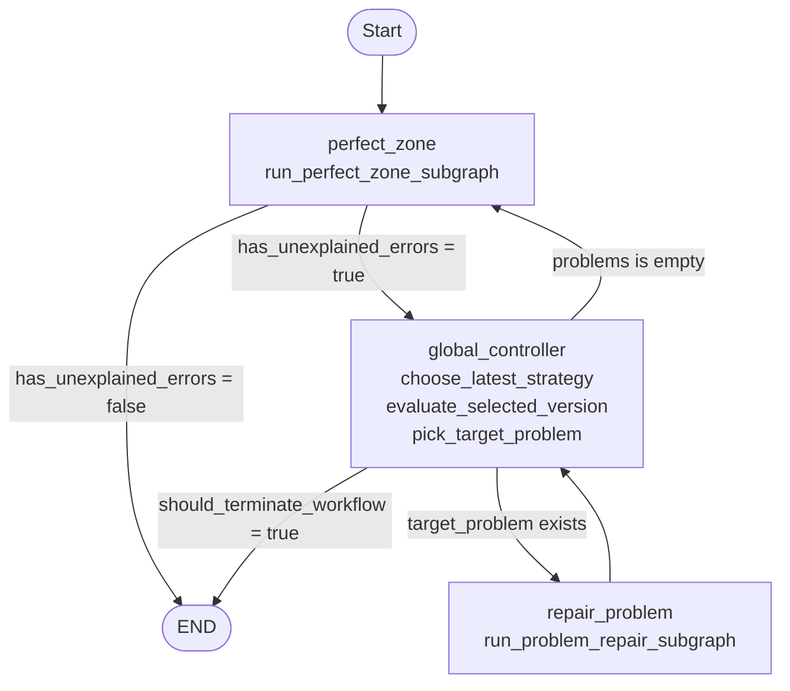
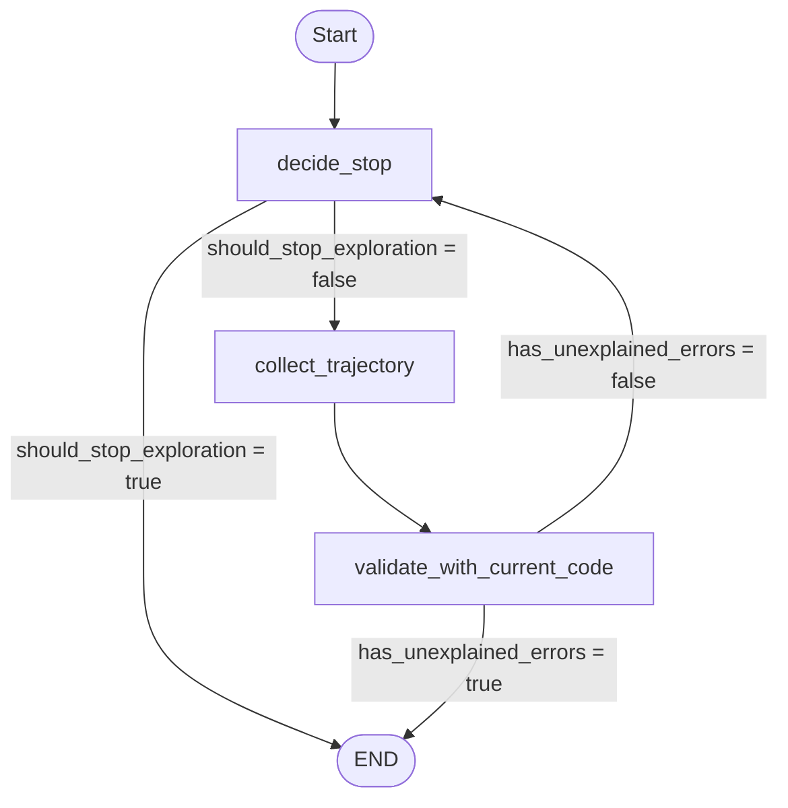
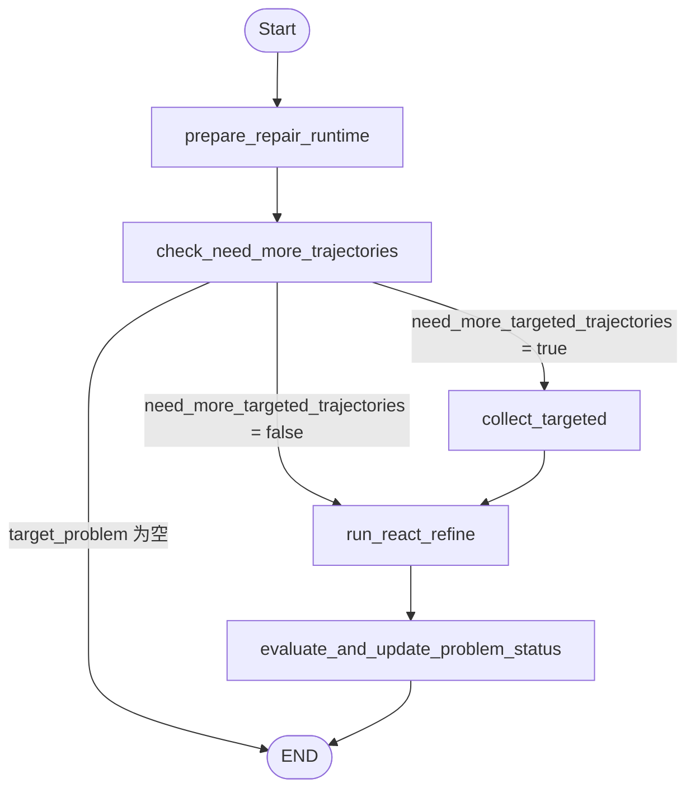
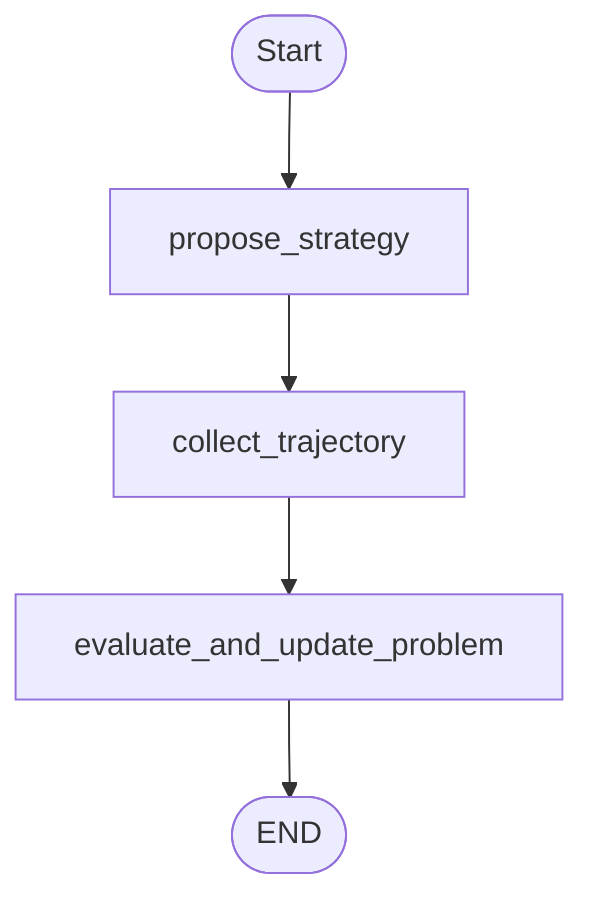
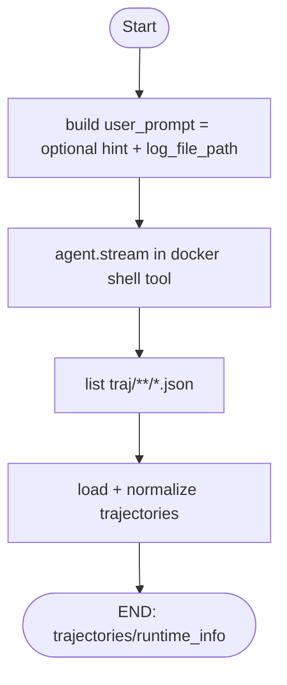
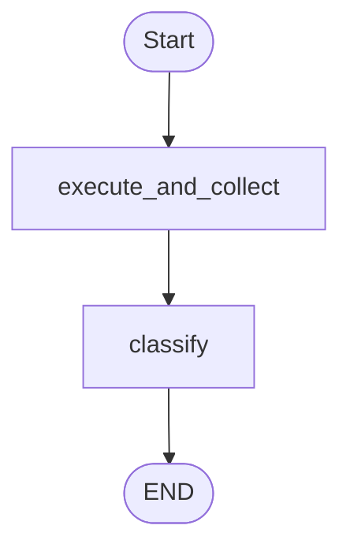
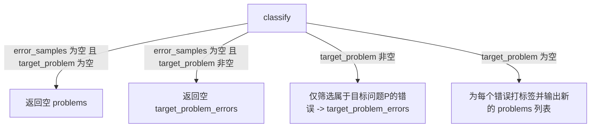

# workflow_graph 顶层逻辑

先绘制 `workflow_graph.py` 的主流程，不展开子图内部实现（`perfect_zone_graph`、`problem_repair_graph`、`error_analysis_graph`）。

## 路由条件对应

- `perfect_zone -> END`：`has_unexplained_errors == false`
- `perfect_zone -> global_controller`：`has_unexplained_errors == true`
- `global_controller -> repair_problem`：`target_problem` 存在
- `global_controller -> perfect_zone`：`problems` 为空（全部轨迹运行无错误）
- `global_controller -> END`：无可修复问题且 `should_terminate_workflow == true`
- `evaluate_selected_version` 与 `pick_target_problem`：已并入 `global_controller`
- `repair_problem -> global_controller`：无条件跳转

---

## perfect_zone_graph

`workflow_graph` 中 `perfect_zone` 节点调用 `run_perfect_zone_subgraph`，其内部图如下：

### perfect_zone_graph 关键状态产出

- `decide_stop`：读取日志文件并判定探索是否已充分（`should_stop_exploration=true`），若充分则结束
- `collect_trajectory`：调用通用 `collect_agent`（依靠日志文件和 hint），更新 `latest_trajectories` 与 `trajectory_library`
- `validate_with_current_code`：执行 checker 校验，并设置 `has_unexplained_errors`

---

## problem_repair_graph

`workflow_graph` 中 `repair_problem` 节点调用 `run_problem_repair_subgraph`，其内部图如下：

### problem_repair_graph 路由说明

- `repair_problem` 依赖 `global_controller` 事先写入单个 `target_problem`
- 若 `target_problem` 为空，`repair_problem` 直接结束
- 若 `need_more_targeted_trajectories = true`，先进入 `collect_targeted` 做一次优先收集，再进入 `run_react_refine`
- `run_react_refine` 与 `evaluate_and_update_problem_status` 已直接作为 `problem_repair_graph.py` 内部节点；不再单独封装 shell_refine 子图
- `run_react_refine` 可通过 tool 调用 targeted trajectory collect agent
- `run_react_refine` 前会先将目标问题 `trajectory_pool` 写入容器 `traj/problem_pool`；若 refine 阶段触发了 targeted collect，会再次同步 pool 后再进行定向评估
- `evaluate_and_update_problem_status` 调用 `run_error_analysis(..., target_problem=...)` 做定向评估，据此判断该问题是否已修复，并更新问题的 `tried`/`solved` 状态及错误样本。若修复成功，还会更新全局代码。
- 预算累计、`solved` 更新等状态管理在本轮 `repair_problem` 结束后直接返回上层工作流

---

## targeted_collection_graph

`targeted_collection_graph` 目前有统一的入口：

- `run_targeted_collection_subgraph`（可被 `problem_repair_graph.py` 内部 `run_shell_refine` 流程中的 `collect_targeted_trajectories` tool 调用，或直接作为节点调用）

其内部 `targeted_collection_graph` 如下：

### targeted_collection_graph 关键状态产出

- `propose_strategy`：基于当前问题摘要产出 `collect_hint`（软引导提示）与假设描述
- `collect_trajectory`：调用通用 `collect_agent`，结合 `hint` 产出 `targeted_new_trajectories`
- `evaluate_and_update_problem`：调用 `run_error_analysis(..., target_problem=...)` 获取过滤后的错误，并调用 `build_problem_samples_from_errors` 和 `append_problem_samples` 将新轨迹及其匹配错误写回目标问题的 `problem_samples` 中。

---

## collect_agent（共享采集流程）

`run_collect_agent` 在当前工作流里有 **两个调用点**：

- `perfect_zone_graph.py` 的 `collect_trajectory` 节点（探索型 collect，传 exploration hint）
- `targeted_collection_graph.py` 的 `collect_trajectory` 节点（问题定向 collect，传 targeted hint）

其内部可抽象为以下共享流程：

### collect_agent 关键输出

- `trajectories`：归一化后的轨迹（由 `max_loaded_trajectories` 截断）
- `runtime_info`：镜像/工作目录等运行时信息，供上层日志与调试复用

---

## error_analysis_graph

`run_error_analysis` 在当前工作流里有 **三个调用点**：

- `global_controller.py` 的 `choose_latest_strategy`（evaluate_selected_version）
- `problem_repair_graph.py` 的 `evaluate_and_update_problem_status` 节点（target mode，带 `target_problem`）
- `targeted_collection_graph.py` 的 `evaluate_and_update_problem` 节点（target mode，带 `target_problem`）

其内部 `error_analysis_graph` 如下：

### error_analysis_graph 两种 classify 模式

### error_analysis_graph 关键输出

- `execute_and_collect`：输出 `coding_can_explain` 与 `error_samples`
- `classify`：
  - `target_problem` 非空时，重点输出 `target_problem_errors`
  - 否则按当前错误打标签并输出新的 `problems` 列表（空错误则 `problems=[]`）

